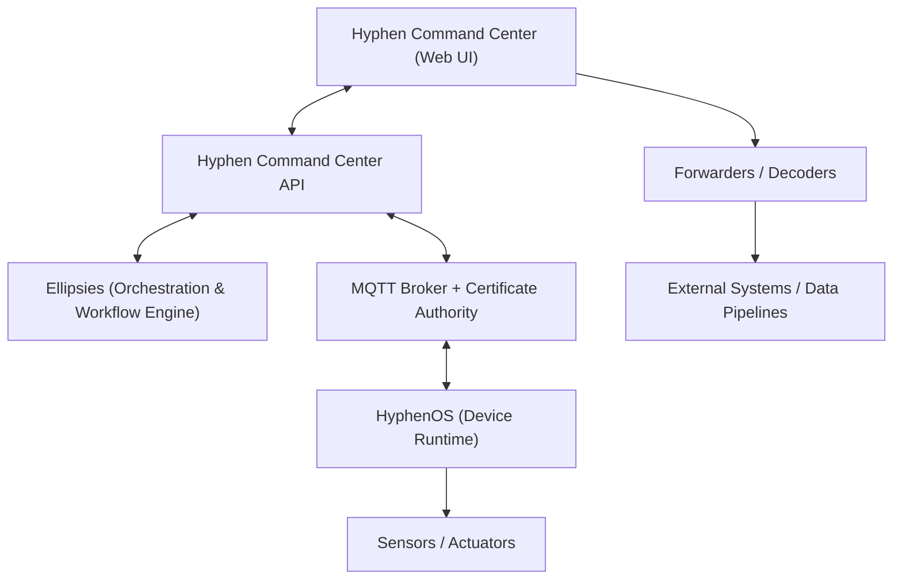

# 🌐 Hyphen Command Center API

**Hyphen Command Center API** is the backend service of the **Hyphen ecosystem** —  
Similie's open, extensible infrastructure for IoT device management, firmware builds,  
and secure real-time communication through MQTT.

It is built on top of [**Ellipsies**](https://github.com/similie/ellipsies) —  
Similie's TypeScript framework for service orchestration using **TypeORM**, **routing-controllers**,  
and **dependency injection** — enabling fast, modular, production-grade microservices.

---

## 🧭 Overview

The Hyphen Command Center API acts as the **control plane** for connected devices.  
It manages:

- Device registration, telemetry, and command routing
- Secure MQTT communication (AWS IoT Core or alternative brokers)
- Firmware build orchestration through isolated Docker build containers
- Payload forwarding to subscribed services
- Authentication, authorization, and configuration lifecycle

This API is designed to integrate directly with:

- 🖥️ [**Hyphen Command Center (Frontend UI)**](https://github.com/similie/hyphen-command-center) —  
  SvelteKit-based interface for managing devices, builds, and operations
- 🔌 [**Hyphen Connect**](https://github.com/similie/hyphen-connect) —  
  The ESP32-compatible firmware client library that allows embedded systems to connect securely

---

## 🧱 Architecture

                    ┌────────────────────────┐
                    │   Hyphen Command UI    │
                    │ (SvelteKit Frontend)   │
                    └──────────┬─────────────┘
                               │
                  REST / SSE   │
                               ▼
                   ┌──────────────────────────┐
                   │ Hyphen Command Center API│
                   │  (Node.js / Express)     │
                   │                          │
                   │ • Auth / Identity        │
                   │ • Device Registry        │
                   │ • MQTT Integration       │
                   │ • Job Queue (BullMQ)     │
                   │ • Webhooks / Streams     │
                   └──────────┬───────────────┘
                              │
                              ▼
                ┌──────────────────────────────┐
                │ PostgreSQL / TimescaleDB     │
                │ (Ellipsies ORM Schema)       │
                └──────────────────────────────┘
                              │
                              ▼
                ┌──────────────────────────────┐
                │ MQTT Broker (AWS IoT Core)   │
                │   + Leader Election via Redis│
                └──────────────────────────────┘

---



## ⚡ Features

- **Device Management:** Register, monitor, and control Hyphen-compatible devices
- **MQTT Integration:** Dynamic subscriptions with leader election via Redis
- **Job Queueing:** Asynchronous background processing with BullMQ
- **Database Migrations:** Fully managed with Drizzle ORM and TimescaleDB
- **Streaming API:** Real-time server-sent events for build and telemetry
- **Docker Builds:** On-demand PlatformIO firmware builds via Docker socket
- **Secure Auth:** Role-based access using JWT and bcrypt
- **Extensible:** Modular service runners and seeding system

---

## 🧰 Prerequisites

Before running the API, ensure the following are installed:

- [Node.js 20+](https://nodejs.org)
- [pnpm](https://pnpm.io)
- [Docker](https://www.docker.com/)
- [PostgreSQL 16+ / TimescaleDB](https://www.timescale.com/)
- [Redis 7+](https://redis.io)

Environment variables are defined in `.env`:

```bash
# Database
DATABASE_URL=postgresql://postgres:postgres@db:5432/hyphen

# Make sure you have your MQTT Broker
MQTT_HOST=a123456.iot.ap-southeast-1.amazonaws.com
MQTT_PORT=8883

# set your AWS Credentials
AWS_ACCESS_KEY_ID=
AWS_SECRET_ACCESS_KEY=

# Redis
REDIS_URL=redis://redis:6379

# Clone the repository
git clone https://github.com/similie/hyphen-command-center-api.git
cd hyphen-command-center-api

# Install dependencies
pnpm install

# Run in development
pnpm dev

DB_HOST=localhost
DB_USER=postgres
DB_PASSWORD=postgres
DB_PORT=5432
DB_DATABASE=hyphen_api # this database is not share with Hyphen Command Center UI
MQTT_IOT_ENDPOINT=a123456.iot.us-east-1.amazonaws.com
MQTT_IOT_PORT=8883
SYSTEM_IDENTITY_NAME=CommandCenter # this is the default. The name of the command center app on MQTT
AWS_REGION=
AWS_ACCESS_KEY_ID=
AWS_SECRET_ACCESS_KEY=
MQTT_SUBSCRIPTIONS="Hy/#" # this is the base MQTT topic for listing to payloads. Similie using "Hy/# in production"
JWT_CLIENT_SECRET=MySuperSecret # this MUST match the UI frontend secret key. The JWT coming from your UI must be decoded by the API
ENV_SECRET_KEY=AnotherSecretForSecrets # we encrypt values in the database. This is a secret key for that encryption
REDIS_CONFIG_URL=redis://localhost:6379/1 # this needs to be the same redis URL and DB as the UI.
HOST_BUILDS_PATH= # this defaults to os.tmpDir but for our docker containers, we need to specify
API_SERVICE_ROUTES=/api/v2/ # Similie microservices are on version 2
API_SERVICE_ROUTES=1612 # 1612 is the service port for this application

```

## 🧠 Developer Notes

- Designed to scale with leader election that ensures only one container processes MQTT messages at a time.
- Docker socket mounting allows isolated firmware build environments.
- Seeds are executed via as functions in your models.
- Easily manage your fleet security with certificate-based access to your network
- Requires Hyphen Connect and ESP32-based hardware (some features require HyphenOS).

| Project                   | Description                                                                                                                       | Repository                                       |
| ------------------------- | --------------------------------------------------------------------------------------------------------------------------------- | ------------------------------------------------ |
| **HyphenOS**              | The device runtime environment for ultra-reliable IoT deployments. Includes OTA, telemetry queues, watchdogs, and sensor drivers. | https://github.com/similie/hyphen-os             |
| **HyphenConnect**         | Network + MQTT abstraction layer for ESP32 / Cellular devices. Enables function calls, variable access, and secure OTA.           | https://github.com/similie/hyphen-connect        |
| **Hyphen Command Center** | SvelteKit UI for managing your global device fleet, OTA updates, telemetry, and configuration.                                    | https://github.com/similie/hyphen-command-center |
| **Hyphen Elemental**      | The hardware schematics Similie uses to for our Hyphen Elemental 4 line of Products.                                              | https://github.com/similie/hyphen-elemental      |
| **Ellipsies**             | Workflow + routing engine powering the API: device identity, build pipeline, users, orgs, storage, and message routing.           | https://github.com/similie/ellipsies             |

## 🧑‍💻 Contributing

We welcome community collaboration!

To contribute:

1.  Fork this repository
2.  Create a feature branch
3.  Submit a pull request describing your changes

All contributions are licensed under the same terms as the main project (GPLv3 + Similie commercial terms).

## 🪪 License

This project is licensed under the GPLv3 License with additional commercial-use terms.

Use of this software or any derivatives for commercial or for-profit purposes
requires a commercial license from Similie.
Contact: licensing@similie.org

See the full license in LICENSE.md

## 🌍 About Similie

Similie builds technology for climate resilience and community empowerment.
We develop IoT platforms, AI tools, and open-source systems to help communities better manage weather, water, and environmental risks.

🌐 https://similie.com

### Hyphen Command Center API

© 2025 Similie — All Rights Reserved
Licensed under GPLv3 with Similie Commercial Use Terms
